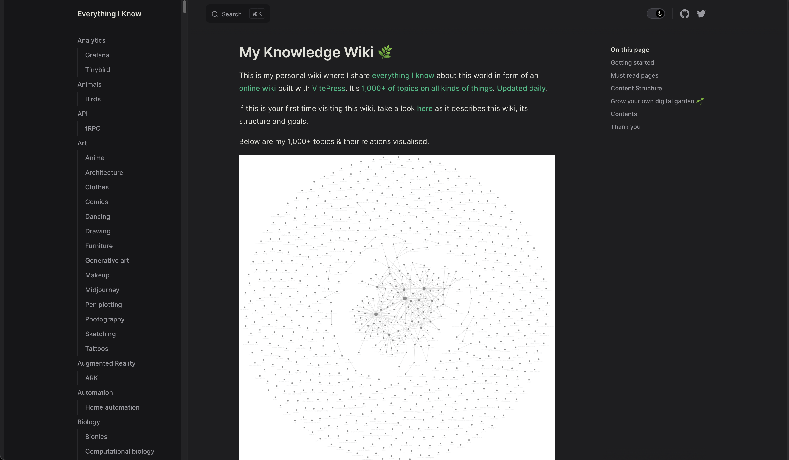
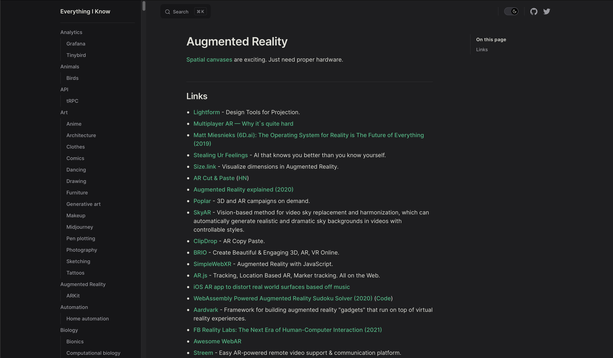

Latest version of my personal wiki can be seen on [wiki.nikiv.dev](http://wiki.nikiv.dev/). With code available [here](https://github.com/nikitavoloboev/wiki).

This is archive of a big wiki that looks like this if rendered. History spans over many years and has a lot of content used to bootstrap [Learn Anything](https://learn-anything.xyz/).

 
